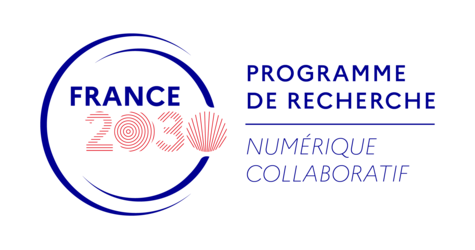

## Presentation

**PC1 CATS (Collaboration Across Heterogeneous Spaces)** aims to design collaboration spaces that enable continuous and seamless collaboration, bridging remote and face-to-face work, tightly coupled and loosely coupled interactions, as well as group collaborations involving spontaneous subgroups or side interactions.

The objective is to address changes of scale along four key dimensions:
1. Diversity of users
2. Diversity of interaction devices/modalities
3. Complexity of datasets, tasks and environments
4. Handling the dynamic transitions between collaboration spaces

The expected breakthrough is the definition of mixed collaboration spaces that place users fully in control while providing rich, flexible, and multi-user experiences.

Since 2023, PC1 has funded 29 PhD students (15 fully funded, 14 partially supported), 2 postdoctoral researchers, and 11 internships.

More info on the PEPR eNSEMBLE homepage: [https://www.pepr-ensemble.fr/cats-espaces-de-collaboration/](https://www.pepr-ensemble.fr/cats-espaces-de-collaboration/)

## Publications

### 2025

1. **N. Salin**, V. Gouranton, F. Berthaut, and R. Gaugne. 2025. Toward Multimodal Asynchronous Collaboration in VR Artistic Creation with S.P.A.R.K. In Proceedings of the 2025 31st ACM Symposium on Virtual Reality Software and Technology (VRST '25). Association for Computing Machinery, New York, NY, USA, Article 68, 1–10. [https://doi.org/10.1145/3756884.3765998](https://doi.org/10.1145/3756884.3765998)
1. **J. L. Meudec**, V. Casamayou, A. Corn, J. Dillmann and A. Ferron, "Treeam: an Immersive and Collaborative Serious Game About Trees and Forest," 2025 IEEE Conference on Virtual Reality and 3D User Interfaces Abstracts and Workshops (VRW), Saint Malo, France, 2025, pp. 1536-1537, [⟨hal-05158583⟩](https://anr.hal.science/hal-05158583/)
1. **J. L. Meudec**, A. Bezerianos and A. Prouzeau, "Shared, Replicated, or Separated? a Comparative Study of Virtual Workspace Configurations for Collaborative Hands-on Learning," 2025 IEEE International Symposium on Mixed and Augmented Reality (ISMAR), Daejeon, Korea, Republic of, 2025, pp. 717-727, [⟨hal-05193514⟩](https://enac.hal.science/LISN-ILDA/hal-05193514v1)
1. **J. L. Meudec**, A. Bezerianos, C. Mercier, A. Prouzeau. Learning with immersive technologies : a VR task to study collaborative learning. IHM'24 - 35e Conférence Internationale Francophone sur l'Interaction Humain-Machine, AFIHM; Sorbonne Université, Mar 2024, Paris, France. [⟨hal-04487309⟩](https://hal.science/hal-04487309v1)
1. **V. Bréhault**, E. Dubois, A. Prouzeau, and M. Serrano. 2025. A Systematic Literature Review to Characterize Asymmetric Interaction in Collaborative Systems. In Proceedings of the 2025 CHI Conference on Human Factors in Computing Systems (CHI '25). Association for Computing Machinery, New York, NY, USA, Article 704, 1–19. [https://doi.org/10.1145/3706598.3713129](https://doi.org/10.1145/3706598.3713129)
1. **T. Fèvre**, A. Chaffangeon Caillet, C. Fleury, and L. Nigay. 2025. Coupling and controlling viewpoints in collaborative mixed reality: the (Point of View)* - PV* graphical notation. In Proceedings of the 36th Conference on l'Interaction Humain-Machine (IHM '25). Association for Computing Machinery, New York, NY, USA, Article 11, 1–16. [https://doi.org/10.1145/3765712.3765723](https://doi.org/10.1145/3765712.3765723)
1. **L. Brand**, S. Kubicki, C. Hoareau, R. Querrec. Approche Centrée Utilisateur pour la Conception d'interfaces de suivi et d'adaptation de procédures en environnements virtuels. In Proceedings of the 36th Conference on  l'Interaction Humain-Machine (IHM'25), AFIHM; Université de Toulouse; ENAC, Nov 2025, Toulouse, France. [https://hal.science/hal-05299272](https://hal.science/hal-05299272)
1. **M. Bitar**, J. -P. Rivière, R. Fribourg, J. -M. Normand and Y. Prié, "Sustaining the Experience of Pair Natural Walking in Social Virtual Reality," 2025 IEEE Conference on Virtual Reality and 3D User Interfaces Abstracts and Workshops (VRW), Saint Malo, France, 2025, pp. 275-281, doi: [10.1109/VRW66409.2025.00065](https://doi.org/10.1109/VRW66409.2025.00065)
1. **C. Cunin**, T. Duval and C. Fleury, "Challenges in Enabling Industrial End-Users to use AR and VR for 3D Authoring of Digital Twins for the Factory of the Future," 2025 IEEE Conference on Virtual Reality and 3D User Interfaces Abstracts and Workshops (VRW), Saint Malo, France, 2025, pp. 455-458, doi: [10.1109/VRW66409.2025.00099](https://ieeexplore.ieee.org/document/10972668)
1. **M. Boukli-Hacene**, "\[DC\] Bridging the Gap Between Real and Virtual Touch : Multisensory Avatars for Enhanced Training in Virtual Reality," 2025 IEEE Conference on Virtual Reality and 3D User Interfaces Abstracts and Workshops (VRW), Saint Malo, France, 2025, pp. 1558-1559, [⟨hal-05000274⟩](https://hal.science/hal-05000274v1)
1. **T. Lannuzel**, B. Biancardi, M. Barange, and S. Buisine. 2025. Towards a Dynamic Model of Collective Intelligence: Theoretical Integration, Nonverbal Interaction and Temporality. In Proceedings of the ACM Collective Intelligence Conference (CI '25). Association for Computing Machinery, New York, NY, USA, 129–138. [https://doi.org/10.1145/3715928.3737468](https://doi.org/10.1145/3715928.3737468)
1. **S. Toofany**, A. Lécuyer, F. Argelaguet and J. Saint-Aubert, "“Persuasive Vibrations”: Studying the Influence of Vibration Parameters on Speech Persuasion," in IEEE Transactions on Haptics, vol. 18, no. 4, pp. 850-861, Oct.-Dec. 2025, [⟨hal-05372456⟩](https://cnrs.hal.science/hal-05372456/)
1. **J. Meunier**, S. Rimbert, A. Prouzeau, F. Lotte. Towards a protocol to find neurophysiological markers of collaborations. CORTICO 2025 - COllectif pour la Recherche Transdisciplinaire sur les Interfaces Cerveau-Ordinateur, May 2025, Lyon, France. [⟨hal-05069081⟩](https://hal.science/hal-05069081)
1. **F. G. Vickery**, "\[DC\] Detection of an Isolated User’s (Inter)Actions during an Augmented Reality Guided Procedure: an Application in Space Medicine," 2025 IEEE Conference on Virtual Reality and 3D User Interfaces Abstracts and Workshops (VRW), Saint Malo, France, 2025, pp. 1590-1591, [⟨hal-05127501⟩](https://hal.science/hal-05127501v1/)
1. **M. Yousefi**, J. Frey, S. Rimbert, A. G. Herrera, S. Fleck. Sense-It: Towards new types of BCI-based sensorimotor neurofeedback for motor rehabilitation. SMC 2025 - IEEE International Conference on Systems, Man, and Cybernetics, Oct 2025, Vienna, Austria. [⟨hal-05268313⟩](https://inria.hal.science/hal-05268313v1)
1. **M. Yousefi**, S. Fleck. Elements for understanding and tangibilizing emotional presence in a collaborative learning context. IHM'25 - 36e Conférence Internationale Francophone sur l'Interaction Humain-Machine, AFIHM; Université de Toulouse; ENAC, Nov 2025, Toulouse, France. [⟨hal-05298836⟩](https://hal.science/hal-05298836/)

### 2024

1. C. Simon, **M. Boukli-Hacene**, **F. Lebrun**, S. Otmane, and A. Chellali. 2024. Influence of multimodal instructions on learning tool manipulation skills through mentoring in an immersive environment: Influence des instructions multimodales sur l’apprentissage par compagnonnage des compétences de manipulation d’outil dans un environnement immersif. In Proceedings of the 35th Conference on l'Interaction Humain-Machine (IHM '24). Association for Computing Machinery, New York, NY, USA, Article 1, 1–13. [https://doi.org/10.1145/3649792.3649793](https://doi.org/10.1145/3649792.3649793)
1. C. Simon, **M. Boukli-Hacene**, **F. Lebrun**, S. Otmane and A. Chellali, "Impact of Multimodal Instructions for Tool Manipulation Skills on Performance and User Experience in an Immersive Environment," 2024 IEEE Conference Virtual Reality and 3D User Interfaces (VR), Orlando, FL, USA, 2024, pp. 670-680, [⟨hal-04505824⟩](https://univ-evry.hal.science/hal-04505824v1)
1. **F. G. Vickery**, S. Kubicki, C. Hoareau, **L. Brand**, A. Duval, S. Thierry, and R. Querrec. 2024. Evaluating the effects of Situated and Embedded Visualisation in Augmented Reality Guidance for Isolated Medical Assistance. In Proceedings of the 30th ACM Symposium on Virtual Reality Software and Technology (VRST '24). Association for Computing Machinery, New York, NY, USA, Article 40, 1–11. [https://doi.org/10.1145/3641825.3687708](https://doi.org/10.1145/3641825.3687708)
1. **D. Maruscsák**, B. Bolton, B. Stamnes, M. Swoboda, and C. Sandor. 2024. Phases: Augmenting a Live Audio-Visual Performance with AR. In ACM SIGGRAPH 2024 Real-Time Live! (SIGGRAPH '24). Association for Computing Machinery, New York, NY, USA, Article 7, 1–2. [https://doi.org/10.1145/3641520.3665310](https://doi.org/10.1145/3641520.3665310)

### 2023

1. **D. Maruscsák**, G. Szűcs, J. Vézien, and C. Sandor. 2023. MiniGI: Guerilla Mappings in Miniature. In SIGGRAPH Asia 2023 XR (SA '23). Association for Computing Machinery, New York, NY, USA, Article 18, 1. [https://doi.org/10.1145/3610549.3614612](https://doi.org/10.1145/3610549.3614612)
1. C. Simon, **M. Boukli Hacene**, S. Otmane, A. Chellali, Study of communication modalities to support teaching tool manipulation skills in a shared immersive environment, Computers & Graphics, Volume 117, 2023, Pages 31-41, ISSN 0097-8493, [https://doi.org/10.1016/j.cag.2023.09.011](https://doi.org/10.1016/j.cag.2023.09.011)
1. **Y. Mathilde** and S. Fleck. 2023. Embodying emotional presence through a tangible interface in a hybrid collaborative learning situation: state of the art. In Adjunct Proceedings of the 34th Conference on l'Interaction Humain-Machine (IHM '23 Adjunct). Association for Computing Machinery, New York, NY, USA, Article 2, 1–9. [https://doi.org/10.1145/3577590.3589602](https://doi.org/10.1145/3577590.3589602)

## Acknowledgement

