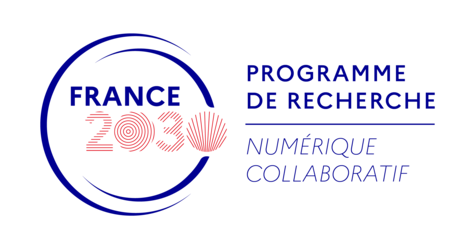

## About

**PC1-CATS (Collaboration Across Heterogeneous Spaces)** aims to design collaboration spaces that enable continuous and seamless collaboration, bridging remote and face-to-face work, tightly coupled and loosely coupled interactions, as well as group collaborations involving spontaneous subgroups or side interactions.

The objective is to address changes of scale along four key dimensions:
1. Diversity of users
2. Diversity of interaction devices/modalities
3. Complexity of datasets, tasks and environments
4. Handling the dynamic transitions between collaboration spaces

The expected breakthrough is the definition of mixed collaboration spaces that place users fully in control while providing rich, flexible, and multi-user experiences.

Since 2023, PC1 has funded 29 PhD students (15 fully funded, 14 partially supported), 2 postdoctoral researchers, and 11 internships.

## Links

- PC1 on the PEPR eNSEMBLE homepage: [https://www.pepr-ensemble.fr/cats-espaces-de-collaboration/](https://www.pepr-ensemble.fr/cats-espaces-de-collaboration/)

## Acknowledgement

This work was supported by a French government grant managed by the Agence Nationale de la Recherche as part of the France 2030 program, reference ANR-22-EXEN-0002 (PEPR eNSEMBLE / PC1 CATS).

